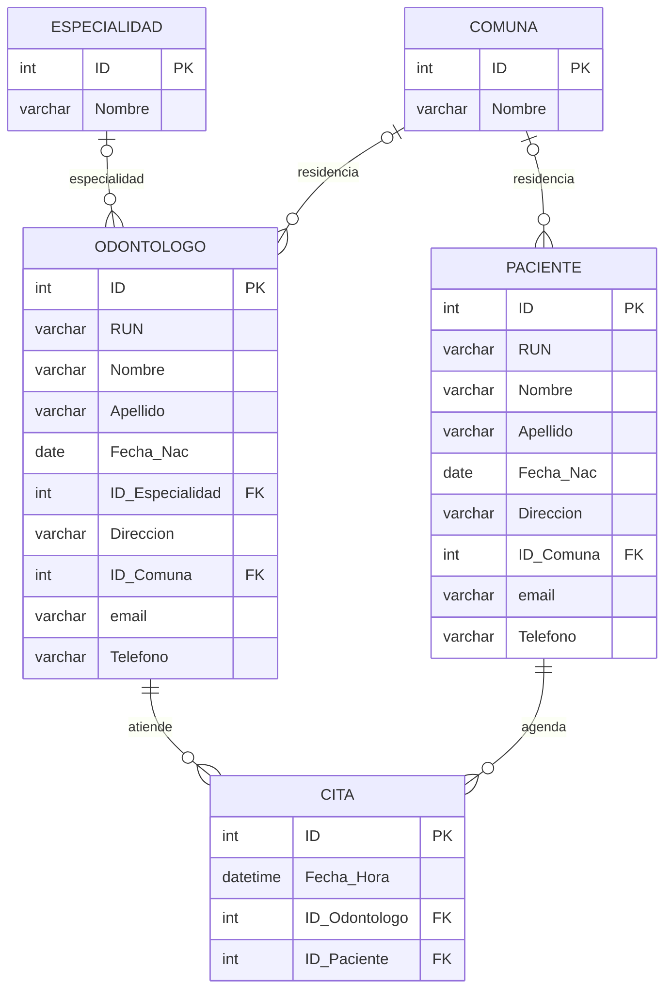

# Control de Pacientes con SQL Server

Proyecto académico de **SQL Server y T-SQL** desarrollado a partir de la **Prueba 1** del curso **“Herramientas para la Programación de Queries con SQL”** de Educación Continua UC.

El proyecto trabaja sobre la base `Control_Pacientes` y evidencia una progresión respecto de ejercicios SQL más básicos: consultas multitabla, `INNER JOIN`, `LEFT JOIN`, agregaciones con `GROUP BY`/`HAVING`, filtrado de fechas, subconsultas correlacionadas y creación de vistas.

## Resumen técnico

| Aspecto | Detalle |
|---|---|
| Motor | Microsoft SQL Server |
| Lenguaje | T-SQL |
| Base de datos | `Control_Pacientes` |
| Modelo | 5 tablas y 5 claves foráneas |
| Datos | 171 registros ficticios de demostración |
| Evaluación | 8 requerimientos SQL |
| Conceptos principales | JOIN, LEFT JOIN, GROUP BY, HAVING, fechas, subconsultas y vistas |

## Alcance académico

La pauta solicita resolver ocho requerimientos sobre la base `Control_Pacientes`:

- **Queries 1–5:** `JOIN` y `LEFT JOIN`, agregaciones y filtrado de fechas.
- **Queries 6–7:** subconsultas.
- **Query 8:** creación de la vista `View_Cita_Completa`.

El repositorio conserva la entrega académica original y, por separado, una **versión revisada para portafolio**. Las correcciones posteriores no se presentan como parte de la entrega original.

Más detalle: [docs/assignment_scope.md](docs/assignment_scope.md).

## Modelo relacional



## Competencias SQL demostradas

| Requerimiento | Técnica principal |
|---|---|
| Query 1 | `INNER JOIN`, alias, ordenamiento por múltiples columnas |
| Query 2 | `LEFT JOIN`, inclusión de valores sin correspondencia |
| Query 3 | `JOIN`, `COUNT`, `GROUP BY`, `ORDER BY` |
| Query 4 | agregación con `HAVING` |
| Query 5 | múltiples `JOIN` y filtrado por rango de fecha/hora |
| Query 6 | subconsulta correlacionada para conteo por paciente |
| Query 7 | subconsultas escalares para atributos relacionados |
| Query 8 | `CREATE VIEW` con múltiples relaciones |

## Estructura del repositorio

```text
.
├── README.md
├── .gitignore
├── sql/
│   ├── 01_joins.sql
│   ├── 02_subqueries.sql
│   ├── 03_view.sql
│   └── 04_validation_checks.sql
├── original/
│   ├── Jorge_Auad_Oliva_Prueba1.sql
│   └── Tablas.sql
└── docs/
    ├── assignment_scope.md
    ├── data_dictionary.md
    ├── query_results.md
    └── technical_review.md
```

## Cómo reproducir el ejercicio

### Requisitos

- Microsoft SQL Server.
- SQL Server Management Studio (SSMS), Azure Data Studio o cliente compatible con T-SQL.

### Ejecución

1. Ejecutar [`original/Tablas.sql`](original/Tablas.sql) para recrear `Control_Pacientes`, sus tablas y los datos ficticios.
2. Ejecutar [`sql/01_joins.sql`](sql/01_joins.sql).
3. Ejecutar [`sql/02_subqueries.sql`](sql/02_subqueries.sql).
4. Ejecutar [`sql/03_view.sql`](sql/03_view.sql).
5. Opcionalmente, ejecutar [`sql/04_validation_checks.sql`](sql/04_validation_checks.sql).

> `Tablas.sql` se mantiene separado de las soluciones para distinguir la preparación de la base de las consultas evaluadas.

## Resultados de referencia

Con los datos incluidos en `Tablas.sql`:

| Query | Resultado de referencia |
|---|---:|
| 1 | 14 pacientes con comuna informada |
| 2 | 14 odontólogos fuera de Santiago o sin comuna |
| 3 | 30 pacientes contabilizados |
| 4 | 4 odontólogos con 10 o más atenciones |
| 5 | 15 citas del 28-01-2016 |
| 6 | 30 pacientes contabilizados mediante subconsulta |
| 7 | 16 odontólogos |
| 8 | 81 filas en `View_Cita_Completa` |

Detalle: [docs/query_results.md](docs/query_results.md).

## Revisión técnica de la entrega original

La entrega original se conserva **sin reescribir su historia**. La versión de portafolio corrige y mejora algunos puntos concretos:

- en Query 5, el apellido del odontólogo debe provenir de la tabla `Odontologo`, no de `Paciente`;
- el filtro de fecha de Query 5 se reescribe como intervalo semiabierto (`>=` / `<`) para evitar aplicar una función sobre la columna;
- en Query 7 se incorpora el `ORDER BY` por especialidad solicitado en la pauta;
- en Query 8 se corrige el apellido del odontólogo y se asignan nombres explícitos a todas las columnas de la vista;
- los alias `A`, `B`, `C` se reemplazan por alias semánticos (`p`, `o`, `c`, `co`, `e`) en la versión revisada;
- Query 3 usa `LEFT JOIN` para respetar literalmente “cada paciente”, aunque en el dataset actual todos poseen al menos una cita.

Los fragmentos identificados en el archivo original como soluciones de la profesora **no se presentan como trabajo propio** en los scripts revisados.

Revisión completa: [docs/technical_review.md](docs/technical_review.md).

## Progresión técnica

Este proyecto continúa el aprendizaje iniciado en [SQL Server — Gestión de Datos Escolares](https://github.com/Koke-Oliva/sql-server-gestion-colegio) e incorpora consultas entre múltiples tablas, agregaciones con `HAVING`, subconsultas y vistas.

La evidencia principal está en **JOINs, agregaciones, subconsultas y vistas**, no en administración de SQL Server ni optimización avanzada.

## Alcance y limitaciones

El proyecto es una evaluación académica y no un sistema clínico u odontológico real. Los datos utilizados son ficticios. No demuestra por sí solo procedimientos almacenados, CTE, funciones de ventana, transacciones complejas, tuning de planes de ejecución ni administración del servidor.

---

**Autor de la entrega académica:** Jorge Auad Oliva  
**Contexto:** Educación Continua, Pontificia Universidad Católica de Chile
