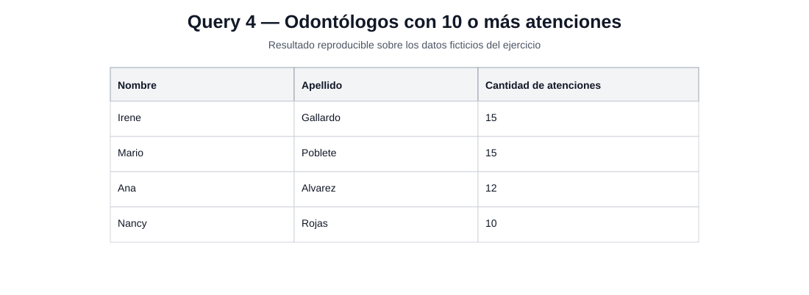
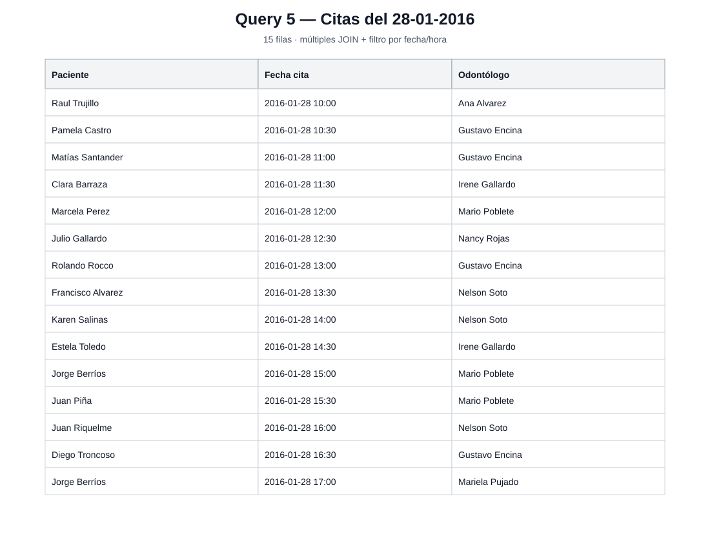
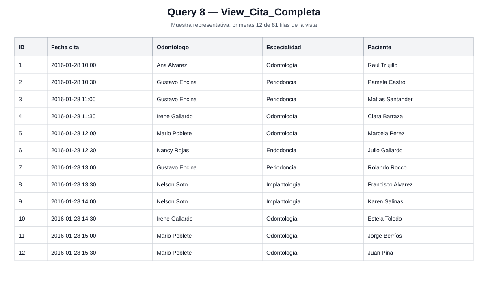

# Resultados representativos

Esta carpeta conserva **tres evidencias visuales representativas** de la versión revisada del proyecto.

Las imágenes se generan a partir de los resultados reproducibles obtenidos con los datos ficticios incluidos en `original/Tablas.sql`. **No son capturas de pantalla de SSMS**; son representaciones visuales de los resultados para facilitar la revisión del repositorio.

## Query 4 — GROUP BY + HAVING

Odontólogos que registran 10 o más atenciones.

**Resultado:** 4 odontólogos cumplen la condición.

---

## Query 5 — múltiples JOIN + fecha/hora

Citas agendadas el 28-01-2016, mostrando paciente, fecha/hora y odontólogo.

**Resultado:** 15 citas.

---

## Query 8 — vista `View_Cita_Completa`

Muestra representativa de la vista creada a partir de Cita, Odontologo, Especialidad y Paciente.

La imagen muestra las primeras 12 filas; la vista completa contiene **81 registros** con los datos del ejercicio.

---

Estas tres evidencias fueron elegidas porque representan los principales avances técnicos de la prueba:

- agregación y filtrado de grupos con `GROUP BY` + `HAVING`;
- combinación de múltiples tablas y tratamiento de `datetime`;
- reutilización de lógica relacional mediante `CREATE VIEW`.

Los resultados completos y sus conteos de referencia están documentados en [`docs/query_results.md`](../docs/query_results.md).
